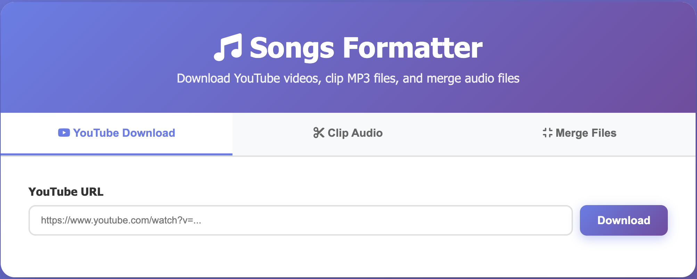
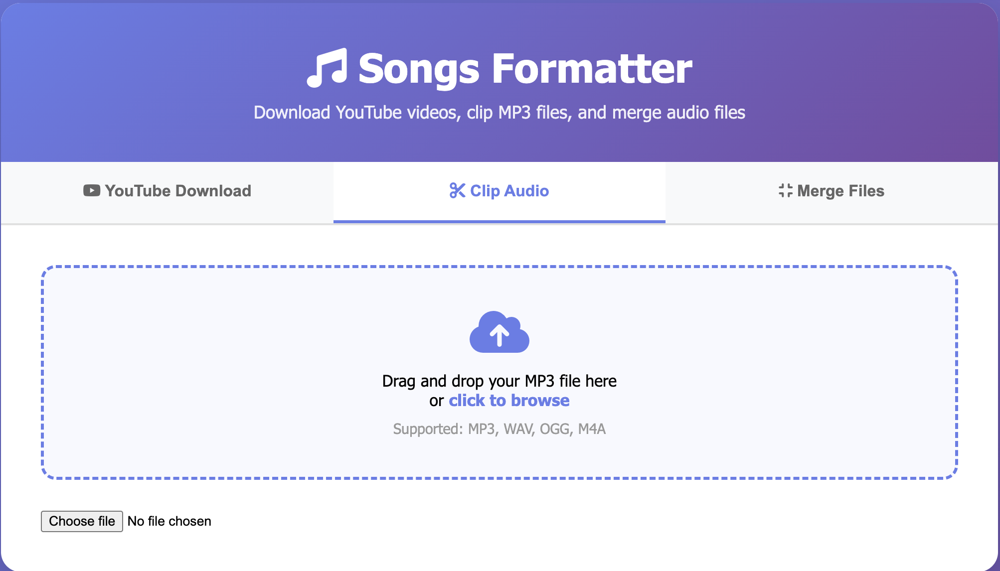
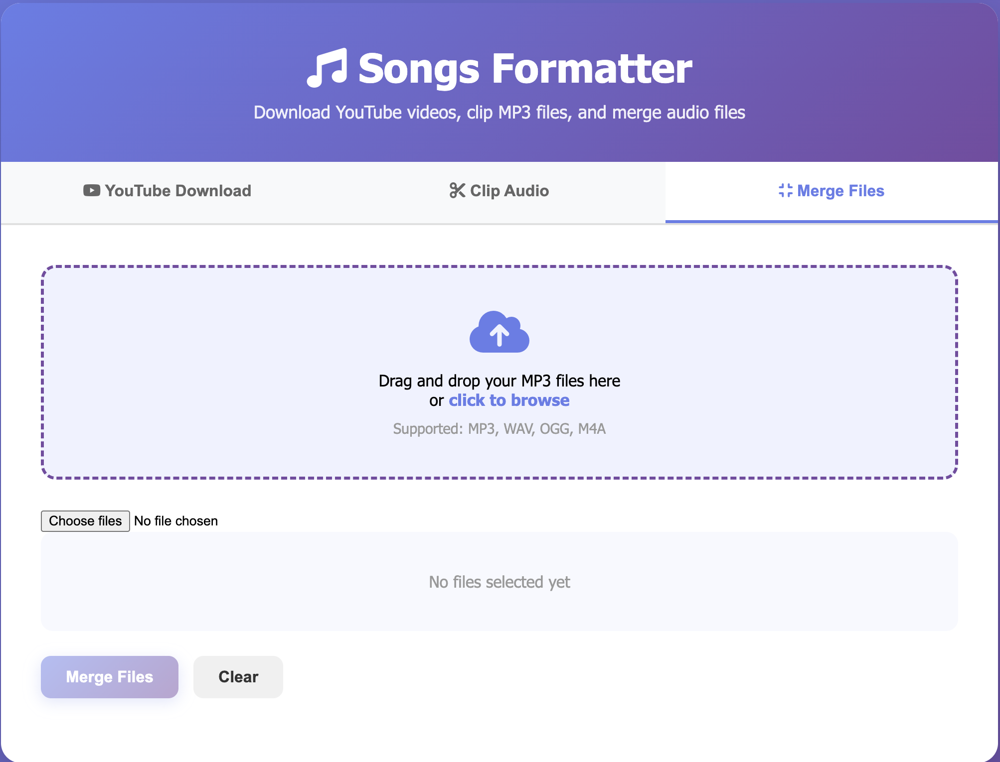

# How to Add Screenshots to Your README

## Quick Guide

### Step 1: Take Screenshots
Capture screenshots of your application using:
- **macOS**: `Cmd + Shift + 4` (select area) or `Cmd + Shift + 3` (full screen)
- **Windows**: `Windows + Shift + S` (Snipping Tool) or `Print Screen`
- **Linux**: `Shift + Print Screen` or use a screenshot tool

### Step 2: Save Screenshots
Save your screenshots in the `screenshots/` directory with descriptive names:
```
screenshots/
├── main-interface.png
├── youtube-downloader.png
├── audio-clipper.png
└── audio-merger.png
```

### Step 3: Add to README.md

#### Basic Markdown Syntax:
```markdown

```

#### Examples:
```markdown
# Main Interface


# YouTube Downloader


# With sizing (HTML in markdown):

```

#### Centered Image:
```markdown
<div align="center">
  
</div>
```

### Step 4: Commit to Git
```bash
git add screenshots/
git add README.md
git commit -m "Add screenshots to README"
git push
```

## Image Optimization Tips

1. **Compress images** to reduce file size:
   - Use [TinyPNG](https://tinypng.com/) or [Squoosh](https://squoosh.app/)
   - Aim for < 500KB per image

2. **Consistent sizing**: Use consistent widths (e.g., 800px) for better appearance

3. **Descriptive alt text**: Always include meaningful alt text for accessibility

4. **File formats**:
   - PNG: Best for screenshots (lossless)
   - JPG: Smaller file size, good for photos
   - GIF: For animated demonstrations

## Example README Section

```markdown
## Screenshots

### Main Interface


### YouTube Downloader


### Audio Clipper


### Audio Merger

```

## GitHub Best Practices

- ✅ Screenshots are automatically displayed in GitHub
- ✅ Use relative paths: `screenshots/image.png` (not absolute paths)
- ✅ Keep images in a dedicated folder (not root directory)
- ✅ Use descriptive filenames (no spaces, use hyphens)
- ✅ Commit images to git (don't use external hosting for README images)

